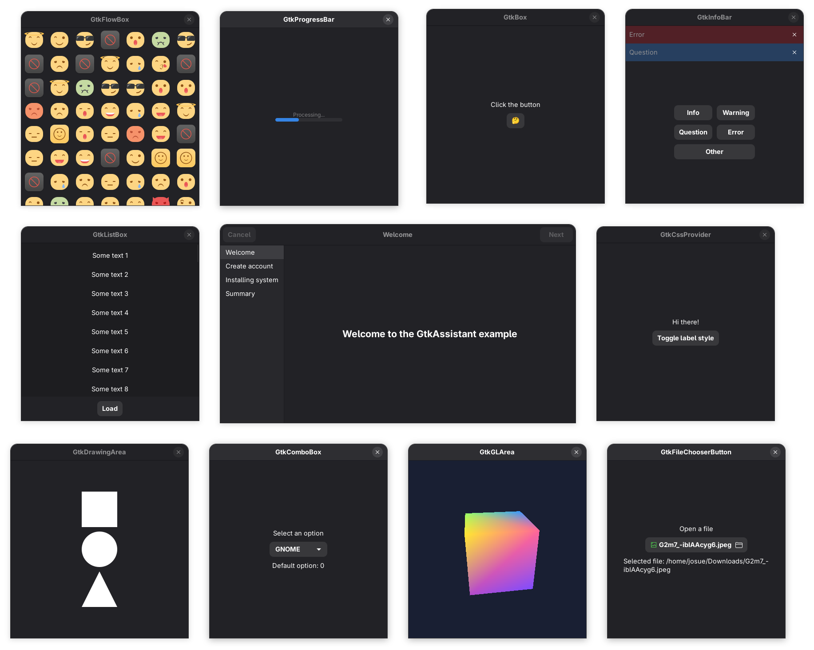

[![License][LicenseBadge]][LicenseURL]

# GTK Examples

> [!NOTE]
> _"It's been X days/weeks/months since last commit, is this project still maintained?"_
> __Yes__. I'm just busy with my job :)

A set of diverse GTK examples written in different programming languages (currently C, Lua & Vala).



## Building and running

The main requirement to build and run the (C and Vala) examples is to have:

  - Development files for GTK (3 and 4)
  - Meson
  - C and Vala compilers
  - Glew development files (needed by the glarea example, only available on Linux for now)

Open a terminal, clone this repository, enter the folder and run the following commands:

```
meson setup _BUILD .
ninja -C _BUILD
```

And that's it! You'll found compiled binaries under the following folders:

  - _BUILD/c/ for the C examples
  - _BUILD/vala/ for the Vala examples

### Lua

In the case of the Lua examples, they're supposed to run on any version of Lua, and the only requirement is to have [LGI](https://github.com/lgi-devs/lgi) installed. If the GTK 4 examples don't work, you might need the Git version of LGI, which requires you to clone and build it by yourself. Any details about that are in the LGI repository.

> [!NOTE]
> To build [LGI](https://github.com/lgi-devs/lgi) you'll need `gobject-introspection`, check out the [LGI repo](https://github.com/lgi-devs/lgi) for more details if you're having trouble.

### Python

You need to have Python installed of course, but also [PyGobject](https://gnome.pages.gitlab.gnome.org/pygobject/index.html) and... That's it 👍.

## GTK 3 and GTK 4

GTK 4 is a huge jump from GTK 3 that came with many changes in the API, deprecating some classes and adding new ones. For that reason, not all GTK 3 examples are available in GTK 4 (and the other way around). Of course, I'll try to have the same examples in both GTK versions, but I can't guarantee all of them will be available. For more details on this, check out [this list](https://docs.gtk.org/gtk4/#classes), which contains all the GTK 4 classes and indicates which ones are deprecated in GTK 4.

## About this repository

I decided to merge all my repos with GTK examples here because I feel that having different repos for the same purpose and with (basically) the same code is a mess, so I prefer to have all these examples in one place.

[LicenseBadge]: https://img.shields.io/badge/License-Zlib-brightgreen?style=for-the-badge
[LicenseURL]: https://opensource.org/licenses/Zlib