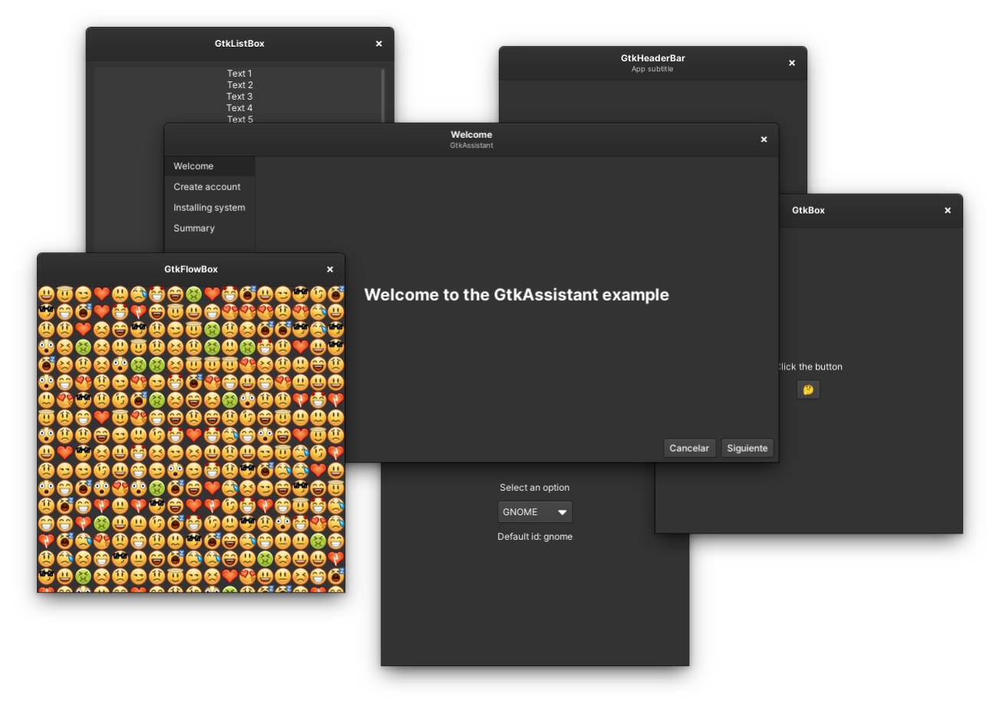

# GTK Examples

A set of various GTK code examples in different programming languages.



## Building and running

The main requirement to build and run the (C and Vala) examples is to have:

  * Development files for GTK (3 and 4)
  * Meson
  * C and Vala compiler

Then just run:

```
meson setup _BUILD .
ninja -C _BUILD
```

And that's it!

### Lua

In the case of the Lua examples, they're supposed to run on any version of Lua, and the only requirement is to have [LGI](https://github.com/lgi-devs/lgi) installed, BUT: I highly recommend you to have the Git version. That's because the Git version supports GTK 4 and libadwaita, so you'll be sure every example will work.

> [!NOTE]
> To build [LGI](https://github.com/lgi-devs/lgi) you'll need `gobject-introspection`, check out the [LGI repo](https://github.com/lgi-devs/lgi) for more details if you're having trouble.

## About this repository

I decided to merge all my repos with GTK examples here because I feel that having different repos for the same purpose and with (basically) the same code is a mess, so I prefer to have all these examples in one place.
