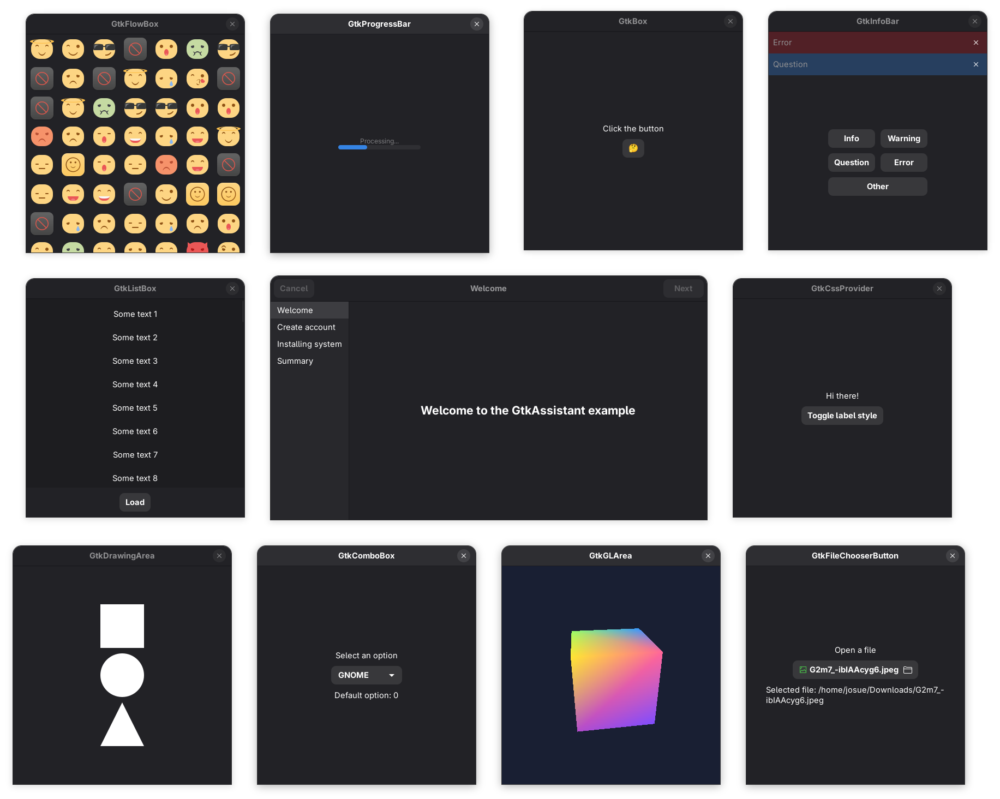

[![License][LicenseBadge]][LicenseURL]

# GTK Examples

> [!NOTE]
> _"It's been X days/weeks/months since last commit, is this project still maintained?"_
> __Yes__, I'm just busy with my job :)

A set of diverse GTK examples written in different programming languages.



## Building/Running

> Please read this section before doing anything :)

To get started, clone this repository and then make sure you have the following things on your development environment:

  - Development files for GTK 3 and GTK 4
  - [libepoxy][libepoxy] (required for the C [GtkGLArea][GtkGLArea] examples)
  - [Meson][Meson] (required to build the C, C++ and Vala examples)
  - [gtkmm][gtkmm] (required for the C++ examples, make sure to get the versions for GTK 3 and GTK 4)
  - [lgi][lgi] (required for the Lua examples)
  - [gobject-introspection][GI] (required for the Lua examples [and perhaps Python and Zig too])
  - [PyGObject][PyGObject] (required for the Python examples)
  - [PyOpenGL][PyOpenGL] (required for the Python [Gtk.GLArea][Gtk.GLArea] example)

Of course, you'll also need the tooling for the languages of your choice:

  - C/C++ compiler (GCC or Clang)
  - Lua
  - Python 3
  - Vala compiler
  - Zig compiler

I believe most (if not all) of these requirements can be easily found in the package manager of your choice, so hopefully, everything should be easy to set up.

### Skipping requirements

Of course, you may not want to try all of the examples in this repository, so getting all of these dependencies could be pointless, and thankfully, you can freely skip the `gobject-introspection`, Lua, Python and Zig dependencies with no problem.

Now, for `libepoxy` and `gtkmm`, you'll need to edit the root `meson.build` file and comment out the lines in which these dependencies are declared. Basically, something like this:

```meson
# For this example, I'm disabling the gtkmm dependencies only
# gtkmm3 = dependency('gtkmm-3.0', required: true)
# gtkmm4 = dependency('gtkmm-4.0', required: true)
```

Perhaps, setting `required` to `false` might also work, but there's a chance the `meson` command will fail to setup the project.

Additionally, you'll also need to comment out some `subdir` function calls in the same file, see the section below for that.

### C, C++ and Vala

Once you got everything ready, you should be able to proceed like this:

```bash
meson setup build
ninja -C build
```

After that, you should a bunch of binaries under the `build/` folder.

#### Filtering examples

As you might have noticed, the C, C++ and Vala examples are all built together, but there's a chance that you might want build only certain examples. For example: C++ GTK 3, C GTK 4, and so on.

In that case, you could try commenting out the `subdir` function calls in the root `meson.build` file. For example, this will only set up the Lua examples:

```meson
# subdir('c/gtk3')
# subdir('c/gtk4')
# subdir('cpp/gtk3/oop')
# subdir('cpp/gtk3/procedural')
# subdir('cpp/gtk4/oop')
# subdir('cpp/gtk4/procedural')
subdir('lua/gtk3')
subdir('lua/gtk4')
# subdir('vala/gtk3')
# subdir('vala/gtk4')
```

There's even a way to build only singular Meson/Ninja targets, but I don't quite remember at the moment.

If you don't know any of Meson, I recommend checking out their [website][Meson] or you could ask the LLM of your choice and it should be able to give you a competent answer.

### Lua

As long as you have Lua 5.1+ and [lgi][lgi], you _should_ be able to run these examples with no problem.

You'll notice that some Lua examples are `.in` files, those require you to run the `meson` tool first, just as explained in the sections above. The only difference is that the `ninja` step won't be necessary.

If the GTK 4 examples don't work, you might need the git version of lgi, which requires you to clone the repository and build lgi by yourself.

> [!NOTE]
> To build [lgi][lgi] you'll need `gobject-introspection`, check out the [lgi's repository][lgi] for details.

### Python

Whatever version of Python 3 you have should work. [PyGObject][PyGObject] is the main dependency to run these examples, [PyOpenGL][PyOpenGL] is only needed for the [Gtk.GLArea][Gtk.GLArea] example as previously mentioned, you should be able to identify the correct file immediately.

### Zig

If you cloned this repository without the `--recurse-submodules` flag, you'll need to run this before continuing:

```bash
git submodules update --init --recursive
```

Once that finishes, you can run:

```bash
zig build
```

After that, check out the `zig/zig-out/bin/` folder for the binaries.

## About GTK 3 vs GTK 4

GTK 4 is a huge jump from GTK 3 that came with many changes in the API, deprecating some classes and adding new ones. For that reason, not all GTK 3 examples are available in GTK 4 (and the other way around). Of course, I'll try to have the same examples in both GTK versions, but I can't guarantee all of them will be available. For more details on this, check out [this list][GTK4ClassList], which contains all the GTK 4 classes and indicates which ones are deprecated in GTK 4.

## About this repository

This repository is a merge of all my previous repositories that had GTK examples. At some point I decided to do this simply because I wanted a centralized place to have all this code and to keep things organized.

[GI]: https://gitlab.gnome.org/GNOME/gobject-introspection\
[lgi]: https://github.com/lgi-devs/lgi
[Meson]: https://mesonbuild.com
[gtkmm]: https://gtkmm.gnome.org/en/index.html
[libepoxy]: https://github.com/anholt/libepoxy
[PyOpenGL]: https://mcfletch.github.io/pyopengl/
[PyGObject]: https://pygobject.gnome.org
[GtkGLArea]: https://docs.gtk.org/gtk4/class.GLArea.html
[Gtk.GLArea]: https://api.pygobject.gnome.org/Gtk-4.0/class-GLArea.html
[LicenseURL]: https://opensource.org/licenses/Zlib
[LicenseBadge]: https://img.shields.io/badge/License-Zlib-brightgreen?style=for-the-badge
[GTK4ClassList]: https://docs.gtk.org/gtk4/#classes